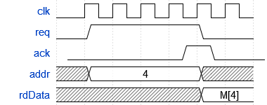
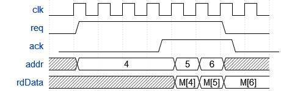
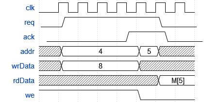

# Notes

## Cache
The initial cache design is a direct-mapped cache only supporting word-aligned access.
But, it should hopefully become a modular cache that supports N-way cache structure,
as well as non-aligned memory accesses. We'll see how difficult that is.

Initial layout:
- Word size: 32 bits
- Word per block: 4
- Blocks: 256
- Total size: 256 block * 4 words/block * 4 bytes/word = 4096 bytes
- write-back operations

Using the above, we get
- 2 bits for byte offset
- 2 bits for block offset
- 8 bits for index
- 20 bits for tag

## Cache controller
Note: Heavily inspired by H&P chapter 5.9, at least for the initial design
The cache controller is a simple FSM used to control the cache. It generates inputs/outputs to
cache module and the replacement policy module

The cache assumes the following interface between processor and cache
- boolean read/write line
- 32-bit address
- 32-bit write data from processor
- 32-bit read data from processor
- request/acknowledge handshake

And assumes the following interface between cache and main memory
- boolean read/write line
- 32-bit address
- 32-bit write data to memory
- 32-bit read data from memory
- request/acknowledge handshake

## Replacement
The replacement module is used to choose which cache block a load should
go into when a way-separated cache is being used. When the cache is direct-mapped,
the replacement is simple, as only one memory block is used.

I/O ports into replacement
- mem.valid: when mem.valid=true, we combinatorially assert signals into controller/cache
- proc.addr: Use proc.addr to determine indices -> which to replace

When mem.valid goes high, start processing read data

I/O ports between replacement and cache
- we: Vec: Which blocks should have data read into them
- valid: Bool: When high, writes data into blocks
- select: Vec: Selects which memory block should be written into

I/O ports between replacement and controller
- index: Used to index into LRU array
- finish: Indicates that a full block of cache has been loaded

# Structure
- cache holds memory blocks that is the cache itself. 
- The controller contains an FSM used to control the cache and replacement module, as well as tag data and dirty/valid bits
- The replacement module contains data used for replacement purposes (LRU?)

## General
Inputs must be held constant until the clock cycle where the cache returns ack=1
On that clock cycle, signals may be deasserted, but not before. 
This is because the cache uses RegNext(input) to select which cache block to read/write from

## Reading
Timing diagram shows behavior for a read to a non-cached address. The `we`and `wrData` 
lines are not shown for simplicity. They are both 0.
When `req` goes high, an operation is started. It must be kept high until `ack` is returned.
When `ack`goes high, read data is valid on the **next** clock cycle.

Once a block is cached, subsequent acceses can be performed with a single clock cycle
latency, as shown below

Notice that once `req` is deasserted, the value of rdData is kept constant.

When writing, the timing behaviour is much the same. The diagram below shows a write
to a non-cached address, immediately followed by a read to that same address.

When an operation is issued, this is forwarded from the Cache module to 
the controller module. The controller module will check if the tag
at the current index matches, and whether the valid bit is set
- If true, on the next clock cycle, it will set valid=true and data will
  be read from memory
- If false, it will go into a load-state, issuing a load to main memory for
  the addresses corresponding to the current cache block.
  - Depending on the ratio between cache-to-memory bus width and block size, N reads will be issued
  - These reads are generated in sequence: It is assumed that a buffer/fifo will keep these reads and they do not get lost
  - Addresses are generated in controller module
  - When this arrives from memory, it will be stored into the cache by replacement module.
  - The Replacement module is used to select which cache block should be updated
    in case of a way-separated cache
  - Once all N reads have arrived, replacement module signals to controller that it may continue
- Once the load operations is finished, we issue a new read, finding
  valid data and returning this to the processor

- If the field being replaced contains dirty data, we first store that data
- back into memory, then perform the memory read. 

## Writing
General outline as above
- If that address is already stored in cache, modify the data and return to processor
- If data is not stored, first issue a load, then modify data in cache
  - Loading data follows same procedure as described above

# Progress

**Setup**
 - [x] Create controller
 - [x] Create replacement module
 - [x] Create cache module itself

**Reading**   
 - [x] Read from word-aligned addresses
   - [x] Issue read on next clock cycle
   - [x] Issue read after a couple of clock cycles
 - [ ] Read from non-aligned addresses
   - [ ] On next clock cycle
   - [ ] After a couple of cycles
 - [ ] Mix word-aligned and non-aligned acceses

**Writing**
- [ ] Write to a valid, non-dirty address
- [ ] Write to a valid, dirty address
- [ ] Write a non-valid address

**Mixing**
- [ ] Read after write
- [ ] Write after read